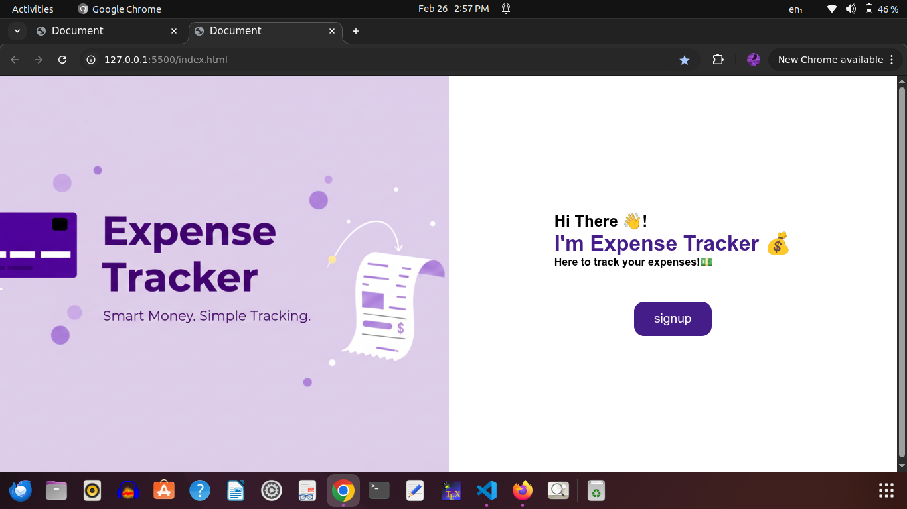
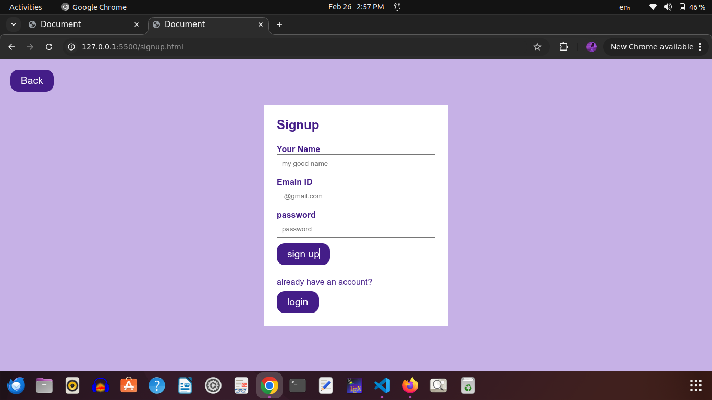

# 💰 Expense Tracker Web Application

A web-based Expense Tracker application that allows users to manage their income and expenses efficiently with real-time database integration and visual analytics.

---

## 🚀 Features

- 🔐 User Authentication (Signup & Login)
- ➕ Add Expenses
- ✏️ Edit Expenses
- ❌ Delete Expenses
- 📊 Category-wise Expense Chart
- 📅 Date Grouping (Today / Yesterday / Older)
- 💵 Remaining Balance Calculation
- ☁️ Firebase Firestore Database Integration

---

## 🛠️ Tech Stack

- HTML
- CSS
- JavaScript
- Firebase Authentication
- Firestore Database
- Chart.js

---

## 📂 Project Structure

- `index.html` – Landing page
- `login.html` – Login page
- `signup.html` – Signup page
- `dashboard.html` – User dashboard
- `dashboard.js` – Dashboard logic
- `form.js` – Expense form handling

---

## 📈 What I Learned

- Implementing authentication using Firebase
- Working with Firestore database
- Managing real-time data
- Creating dynamic dashboards
- Data visualization using Chart.js

---

## 🔮 Future Improvements

- Monthly & yearly reports
- Dark mode
- Mobile responsiveness improvements
- Export data as CSV
- Budget goal tracking

---
## 🌐 Live Demo
https://jennijones943.github.io/expense-tracker/
#📷 screenshots
#desktop view

#signup view

#dashboard view
[dashboard view](dashboard.png)
[dashboard view](dashboard2.png)

## 👩‍💻 Author

JenniJones  
GitHub: https://github.com/jennijones943